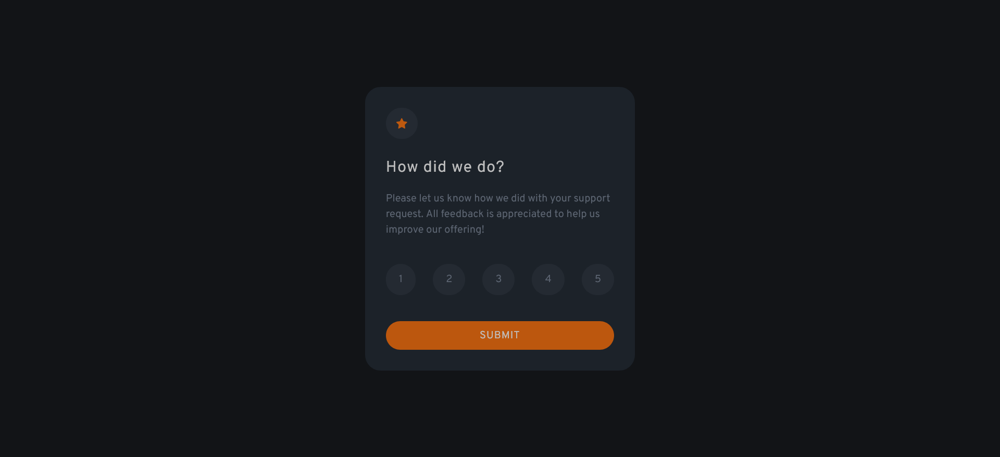
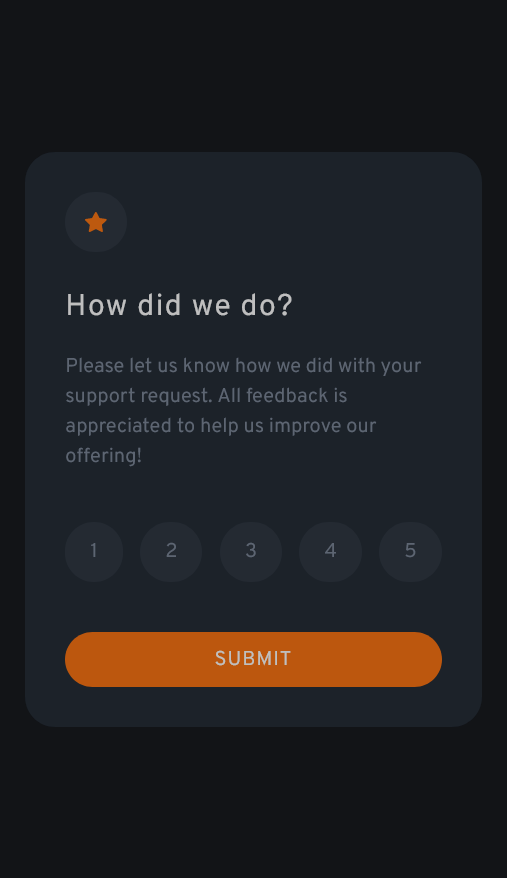

# Frontend Mentor: solución de componente de calificación interactiva

Esta es una solución al [desafío del componente de calificación interactiva en Frontend Mentor] (https://www.frontendmentor.io/challenges/interactive-rating-component-koxpeBUmI). Los desafíos de Frontend Mentor lo ayudan a mejorar sus habilidades de codificación mediante la creación de proyectos realistas.

## Tabla de contenido

- [Frontend Mentor: solución de componente de calificación interactiva](#frontend-mentor-solución-de-componente-de-calificación-interactiva)
  - [Tabla de contenido](#tabla-de-contenido)
  - [Descripción general](#descripción-general)
    - [El reto](#el-reto)
    - [Captura de pantalla](#captura-de-pantalla)
      - [Diseño Desktop](#diseño-desktop)
      - [Diseño Mobil](#diseño-mobil)
    - [Enlaces](#enlaces)
    - [Construido con](#construido-con)
  - [Autor](#autor)

## Descripción general

### El reto

Los usuarios deberían poder:

- Ver el diseño óptimo para la aplicación según el tamaño de pantalla de su dispositivo
- Ver estados de desplazamiento para todos los elementos interactivos en la página
- Seleccionar y enviar una calificación numérica
- Ver el estado de la tarjeta "Gracias" después de enviar una calificación

### Captura de pantalla

#### Diseño Desktop

#### Diseño Mobil

### Enlaces

- URL de la solución: [gitHub](https://github.com/jean266/principal-calificacion-interativa.git)
- URL del sitio en vivo: [Vercel](https://your-live-site-url.com)

### Construido con

- Flexbox
- Flujo de trabajo móvil primero
- Tailwindcss
- Node.js - Express

## Autor

- Mentor de frontend - [@jean266](https://www.frontendmentor.io/profile/jean266)
